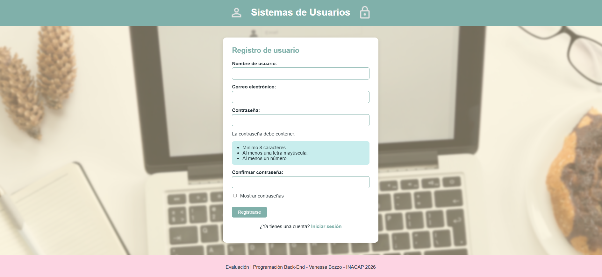
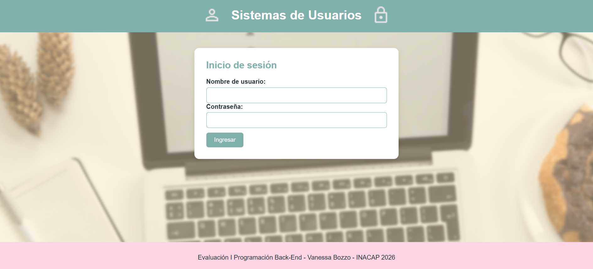

# EVA1 - Programación Back-End | Django

Proyecto desarrollado para la **Evaluación 1 de Programación Back-End**, correspondiente a la carrera de **Analista Programador en INACAP**.

La aplicación implementa un sistema básico de **registro e inicio de sesión de usuarios** utilizando Django y Python en el Back-End, junto con HTML, CSS y JavaScript para la interfaz.

---

## 📌 Descripción del proyecto

El sistema permite registrar usuarios, validar los datos ingresados e iniciar sesión utilizando las credenciales almacenadas temporalmente durante la ejecución del servidor.

El proyecto fue desarrollado aplicando conceptos de Django como:

- Views.
- URLs.
- Templates.
- Context.
- Loader.
- Shortcut `render()`.
- Herencia de templates.
- Template Tags.
- Archivos estáticos.
- Integración de CSS, JavaScript e imágenes.

---

## 🖥️ Vista del proyecto

### Registro de usuarios



### Inicio de sesión



---

## ✅ Funcionalidades

### Registro de usuarios

El sistema permite:

- Registrar nombre de usuario.
- Registrar correo electrónico.
- Registrar contraseña.
- Confirmar contraseña.
- Validar que el nombre de usuario no esté registrado previamente.
- Validar que el correo electrónico no esté registrado previamente.
- Validar que la contraseña tenga al menos 8 caracteres.
- Validar que la contraseña contenga al menos una letra mayúscula.
- Validar que la contraseña contenga al menos un número.
- Validar que ambas contraseñas coincidan.
- Mostrar los errores encontrados durante el registro.
- Mostrar y ocultar las contraseñas mediante JavaScript.
- Mostrar un mensaje cuando el registro se realiza correctamente.

### Inicio de sesión

El sistema permite:

- Iniciar sesión utilizando nombre de usuario y contraseña.
- Validar si el usuario existe.
- Validar si la contraseña ingresada es correcta.
- Mostrar un mensaje de bienvenida cuando las credenciales son correctas.
- Registrar los intentos fallidos de inicio de sesión.
- Mostrar el número de intento incorrecto.
- Reiniciar el contador después de un inicio de sesión correcto.
- Bloquear al usuario después de 3 intentos fallidos.
- Impedir el acceso de un usuario que ya se encuentra bloqueado.

---

## 🛠️ Tecnologías utilizadas

- **Python**
- **Django**
- **HTML5**
- **CSS3**
- **JavaScript**
- **Git**
- **GitHub**
- **Visual Studio Code**

---

## 📁 Estructura principal del proyecto

```text
EVA1_Django/
│
├── capturas/
│   ├── login.png
│   └── registro.png
│
├── miproyecto/
│   ├── plantillas/
│   │   ├── base.html
│   │   ├── inicio.html
│   │   ├── inicio_herencia.html
│   │   ├── registro.html
│   │   ├── resultado_registro.html
│   │   ├── login.html
│   │   └── resultado_login.html
│   │
│   ├── settings.py
│   └── urls.py
│
├── static/
│   ├── css/
│   │   └── estilos.css
│   │
│   ├── images/
│   │   ├── usuario.png
│   │   ├── candado.png
│   │   └── fondo_login.jpg
│   │
│   └── js/
│       ├── registro.js
│       └── login.js
│
├── usuarios/
│   └── views.py
│
├── .gitignore
├── manage.py
├── requirements.txt
└── README.md
```

---

## ⚙️ Requisitos previos

Para ejecutar el proyecto es necesario tener instalado:

- Python.
- Git.
- Un navegador web.
- Visual Studio Code u otro editor de código.

Las dependencias de Python utilizadas por el proyecto están incluidas en:

```text
requirements.txt
```

---

# 🚀 Instalación y ejecución

## 1. Clonar el repositorio

Desde una terminal ejecutar:

```bash
git clone https://github.com/VanessaBozzo/EVA1-Django.git
```

---

## 2. Ingresar a la carpeta del proyecto

```bash
cd EVA1-Django
```

---

## 3. Crear un entorno virtual

```bash
python -m venv venv
```

El entorno virtual permite mantener las dependencias del proyecto separadas de las instalaciones globales de Python.

---

## 4. Activar el entorno virtual

### Windows - PowerShell

```powershell
.\venv\Scripts\Activate.ps1
```

### Windows - CMD

```cmd
venv\Scripts\activate
```

Cuando el entorno se encuentre activo debería aparecer algo similar a:

```text
(venv) PS C:\...\EVA1-Django>
```

---

## 5. Instalar las dependencias

Con el entorno virtual activo:

```bash
pip install -r requirements.txt
```

Esto instalará Django y las dependencias necesarias para ejecutar el proyecto.

---

## 6. Ejecutar el servidor de Django

```bash
python manage.py runserver
```

Si el servidor inicia correctamente aparecerá una dirección similar a:

```text
http://127.0.0.1:8000/
```

---

## 7. Abrir la aplicación

Desde el navegador ingresar a:

```text
http://127.0.0.1:8000/
```

La página principal mostrará el formulario de registro.

Para acceder directamente al inicio de sesión:

```text
http://127.0.0.1:8000/login/
```

---

# 🧪 Ejemplo para probar el sistema

Se puede registrar un usuario utilizando los siguientes datos de prueba:

```text
Usuario: Vanessa
Correo: vanessa@email.com
Contraseña: Vanessa123
Confirmar contraseña: Vanessa123
```

Después se puede ingresar desde el Login utilizando:

```text
Usuario: Vanessa
Contraseña: Vanessa123
```

El resultado esperado es:

```text
Bienvenido, Vanessa
```

También se puede probar el sistema ingresando tres veces una contraseña incorrecta.

Después del tercer intento el sistema mostrará:

```text
Clave bloqueada. Ha superado el máximo de intentos permitidos.
```

---

# 🧠 Funcionamiento general

El proyecto utiliza el flujo básico de Django:

```text
Navegador
    ↓
urls.py
    ↓
views.py
    ↓
Templates
    ↓
Respuesta al navegador
```

En el registro y Login también interviene JavaScript:

```text
HTML
 ↓
JavaScript
 ↓
URL dinámica
 ↓
urls.py
 ↓
views.py
 ↓
Python procesa y valida
 ↓
Template de resultado
```

### `settings.py`

Contiene la configuración general del proyecto, incluyendo:

- Aplicaciones instaladas.
- Ubicación de los templates.
- Configuración de archivos estáticos.

### `urls.py`

Relaciona las direcciones del navegador con las Views correspondientes.

### `views.py`

Contiene la lógica principal del Back-End, incluyendo:

- Registro de usuarios.
- Validación de datos.
- Autenticación.
- Control de intentos.
- Bloqueo de usuarios.

### Templates

Los archivos HTML permiten mostrar la información procesada por Django.

El proyecto utiliza una plantilla principal:

```text
base.html
```

de la cual heredan las demás páginas.

### Archivos estáticos

La carpeta:

```text
static/
```

contiene:

```text
CSS
JavaScript
Imágenes
```

utilizados por la interfaz.

---

# ⚠️ Consideraciones importantes

Este proyecto fue desarrollado **con fines académicos** como parte de una evaluación de Programación Back-End.

Actualmente los usuarios se almacenan temporalmente en una lista de Python:

```python
usuarios_registrados = []
```

Cada usuario es almacenado mediante un diccionario que contiene información como:

```text
usuario
correo
password
intentos
bloqueado
```

Por este motivo, los usuarios registrados existen únicamente mientras el servidor se encuentra ejecutándose.

Al detener o reiniciar el servidor:

```text
usuarios_registrados = []
```

vuelve a quedar vacío y los usuarios registrados anteriormente se pierden.

---

## 🔒 Consideraciones de seguridad

La implementación fue realizada de acuerdo con los contenidos trabajados durante la evaluación y **no corresponde a un sistema de autenticación preparado para producción**.

En la implementación académica actual:

- Las credenciales son transportadas mediante parámetros de URL.
- Las contraseñas se almacenan temporalmente como texto dentro de estructuras de Python.
- No existe persistencia de usuarios en una base de datos.
- No se utiliza todavía el sistema de autenticación de Django.
- Los usuarios se eliminan al reiniciar el servidor.

En una aplicación real se deberían utilizar mecanismos apropiados de autenticación, almacenamiento seguro de contraseñas y persistencia en una base de datos.

Estas mejoras podrán implementarse posteriormente a medida que se incorporen nuevos contenidos de Back-End.

---

# 🌐 Publicación

Actualmente el código fuente del proyecto se encuentra disponible en GitHub.

La aplicación necesita un servidor capaz de ejecutar:

```text
Python + Django
```

por lo que **GitHub Pages no permite ejecutar directamente esta aplicación**, ya que GitHub Pages está orientado principalmente a sitios estáticos.

En una futura versión el Back-End podrá ser desplegado en un servicio compatible con Django para disponer de una versión completamente interactiva en Internet.

---

# 📚 Objetivo académico

El proyecto permite aplicar y demostrar conceptos fundamentales de desarrollo Back-End con Django, tales como:

- Creación de proyectos y aplicaciones Django.
- Configuración de URLs.
- Creación de Views.
- Uso de Templates y Context.
- Uso de Loader.
- Uso del shortcut `render()`.
- Herencia de templates.
- Template Tags como `if` y `for`.
- Manejo de archivos static.
- Integración entre Python, HTML, CSS y JavaScript.
- Validación de datos.
- Manejo de estructuras de datos de Python.
- Lógica de autenticación e intentos de acceso.

---

## 👩‍💻 Autora

**Vanessa Bozzo**

Carrera: **Analista Programador**  
Institución: **INACAP**  
Asignatura: **Programación Back-End**  
Año: **2026**

---

## 📄 Estado del proyecto

✅ Registro de usuarios funcionando  
✅ Validaciones funcionando  
✅ Login funcionando  
✅ Control de intentos funcionando  
✅ Bloqueo al tercer intento funcionando  
✅ Templates funcionando  
✅ CSS funcionando  
✅ JavaScript funcionando  
✅ Imágenes funcionando  

**Proyecto desarrollado como EVA1 de Programación Back-End.**